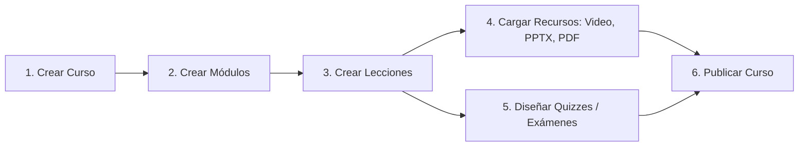
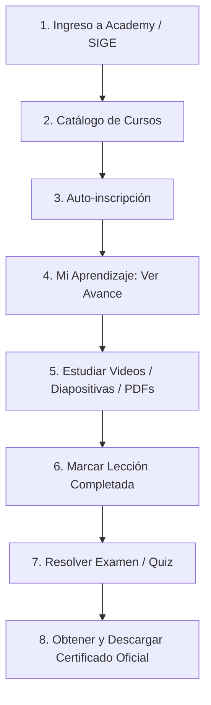

# 📘 Manual Integral de Usuario y Capacitación — Academy LMS
**Plataforma de Formación, Gestión del Conocimiento y Certificación Empresarial**  
*Ecosistema CorpoSuite (`corposuitekrv.com`) — Kezelmedica · Red Beat · Vitaris*  
**Versión:** 2.0  
**Fecha de Actualización:** Septiembre 2026  

---

## 📑 Tabla de Contenido
1. [Visión General y Propósito](#1-visión-general-y-propósito)
2. [Roles y Permisos en la Plataforma](#2-roles-y-permisos-en-la-plataforma)
3. [Formas de Acceso al Sistema](#3-formas-de-acceso-al-sistema)
4. [Guía para Administradores e Instructores: Creación y Gestión de Cursos](#4-guía-para-administradores-e-instructores-creación-y-gestión-de-cursos)
   - [4.1 Cómo Crear un Nuevo Curso](#41-cómo-crear-un-nuevo-curso)
   - [4.2 Cómo Estructurar el Curso con Módulos](#42-cómo-estructurar-el-curso-con-módulos)
   - [4.3 Cómo Agregar Lecciones a los Módulos](#43-cómo-agregar-lecciones-a-los-módulos)
   - [4.4 Cómo Subir Videos, Presentaciones y Documentos](#44-cómo-subir-videos-presentaciones-y-documentos)
   - [4.5 Cómo Diseñar y Configurar Exámenes (Quizzes)](#45-cómo-diseñar-y-configurar-exámenes-quizzes)
   - [4.6 Cómo Calificar Preguntas Abiertas (Revisión Manual)](#46-cómo-calificar-preguntas-abiertas-revisión-manual)
   - [4.7 Publicar, Editar y Archivar Cursos](#47-publicar-editar-y-archivar-cursos)
   - [4.8 Gestión del Libro de Calificaciones (Gradebook)](#48-gestión-del-libro-de-calificaciones-gradebook)
5. [Guía para el Colaborador: Cómo Realizar sus Capacitaciones](#5-guía-para-el-colaborador-cómo-realizar-sus-capacitaciones)
   - [5.1 Ingreso a la Plataforma y Catálogo](#51-ingreso-a-la-plataforma-y-catálogo)
   - [5.2 Cómo Inscribirse a un Curso](#52-cómo-inscribirse-a-un-curso)
   - [5.3 Panel Personal "Mi Aprendizaje"](#53-panel-personal-mi-aprendizaje)
   - [5.4 Cursar Lecciones: Videos, Presentaciones y Documentos](#54-cursar-lecciones-videos-presentaciones-y-documentos)
   - [5.5 Cómo Completar Lecciones y Registrar Avance](#55-cómo-completar-lecciones-y-registrar-avance)
   - [5.6 Cómo Presentar Quizzes y Exámenes](#56-cómo-presentar-quizzes-y-exámenes)
   - [5.7 Acreditación y Descarga del Certificado Oficial](#57-acreditación-y-descarga-del-certificado-oficial)
6. [Guía para Gerentes: Monitoreo de Equipo y Reportes](#6-guía-para-gerentes-monitoreo-de-equipo-y-reportes)
   - [6.1 Panel de Monitoreo de Equipo (`/team`)](#61-panel-de-monitoreo-de-equipo-team)
   - [6.2 Inscripción Masiva de Colaboradores](#62-inscripción-masiva-de-colaboradores)
   - [6.3 Suite de Reportes y Descarga en Excel / PDF](#63-suite-de-reportes-y-descarga-en-excel--pdf)
7. [Preguntas Frecuentes y Resolución de Incidencias](#7-preguntas-frecuentes-y-resolución-de-incidencias)

---

## 1. Visión General y Propósito

**Academy LMS** es el entorno virtual corporativo para la inducción, adiestramiento continuo, actualización operativa y acreditación de competencias de los colaboradores de **Kezelmedica**, **Red Beat** y **Vitaris**.

### Beneficios Principales
- **Aislamiento Multi-Empresa**: Cada empresa gestiona sus propios colaboradores y capacitaciones internas con su propia identidad visual corporativa.
- **Capacitación Autónoma y Flexible**: Los colaboradores pueden estudiar a su propio ritmo, desde cualquier dispositivo de la red o integrados al portal corporativo.
- **Recursos Multimedia Nativos**: Reproducción continua de videos sin pausas de almacenamiento en búfer y lectura de presentaciones y PDFs en un visor embebido.
- **Evaluaciones Transparentes**: Exámenes con retroalimentación inmediata, aleatorización de reactivos y control de intentos.
- **Certificación Institucional con Folio Único**: Emisión automática de diplomas PDF apaisados oficiales en alta resolución listos para auditorías de calidad (ISO, COFEPRIS y normativas laborales).

---

## 2. Roles y Permisos en la Plataforma

| Rol | ¿A quién corresponde? | Principales Funciones y Alcance |
|:---|:---|:---|
| **Colaborador** (`COLLABORATOR`) | Todo el personal operativo, administrativo y técnico | Inscribirse a cursos autorizados, ver videos y presentaciones, realizar evaluaciones, dar seguimiento a su avance y descargar certificados. |
| **Instructor** (`INSTRUCTOR`) | Capacitadores, líderes técnicos y autores de cursos | Crear y estructurar cursos, subir lecciones multimedia, formular exámenes, calificar preguntas abiertas y revisar el Gradebook de **sus propios cursos**. |
| **Gerente** (`MANAGER`) | Jefes de departamento, coordinadores y gerentes de área | Supervisar el progreso de su equipo en `/team`, inscribir colaboradores de su empresa a cursos clave, revisar calificaciones departamentales y descargar reportes. |
| **Administrador** (`ADMIN`) | Dirección de capacitación y administradores globales | Control total: gestión de todas las empresas, asignación de cursos globales, categorías, auditoría completa (`ActivityLog`) y KPIs ejecutivos globales. |

---

## 3. Formas de Acceso al Sistema

### A. Acceso Integrado desde el Portal SIGE (Recomendado para Colaboradores)
1. Inicie sesión habitualmente en el portal corporativo **SIGE** (`sige.corposuitekrv.com`).
2. En la barra de navegación superior o menú lateral, haga clic en la opción **"Capacitación"**.
3. El sistema abrirá automáticamente Academy LMS dentro de la interfaz sin pedirle usuario ni contraseña (autenticación SSO de un solo uso).
4. El entorno detecta el portal y ajusta la pantalla para una navegación limpia y sin duplicidad de menús.

### B. Acceso Directo con Credenciales
1. Ingrese a la dirección oficial: `https://academy.corposuitekrv.com/login`.
2. Escriba su correo electrónico corporativo registrado y su contraseña.
3. Haga clic en **"Iniciar Sesión"**. Será dirigido a su panel principal según su rol.

---

## 4. Guía para Administradores e Instructores: Creación y Gestión de Cursos

Como creador de contenidos, usted puede dar de alta cursos completos organizados de forma modular, subir material multimedia y programar exámenes.

---

### 4.1 Cómo Crear un Nuevo Curso
1. Inicie sesión con un usuario con rol de **Instructor**, **Gerente** o **Administrador**.
2. En el menú lateral izquierdo, diríjase a **Cursos** (`/courses`).
3. Haga clic en el botón superior **"+ Nuevo Curso"** (ruta directa: `/courses/new`).
4. Complete el formulario con la ficha técnica del curso:
   - **Título del Curso**: Nombre claro y descriptivo (ej. *Buenas Prácticas de Almacenamiento y Distribución*).
   - **Descripción**: Resumen pedagógico que explique los objetivos del curso y a quién va dirigido.
   - **Categoría**: Seleccione la categoría temática correspondiente (ej. *Seguridad e Higiene*, *Operaciones y Logística*, *Tecnología y Sistemas*).
   - **Nivel de Dificultad**: Seleccione entre *Principiante*, *Intermedio* o *Avanzado*.
   - **Horas Estimadas**: Duración calculada para completar el curso (ej. `4.5` horas).
   - **Nota Mínima Aprobatoria**: Calificación sobre 100 requerida para acreditar el curso (por defecto `80.0`).
   - **Empresas Asignadas (Solo Administradores)**:
     - Marque una o varias empresas (**Kezelmedica**, **Red Beat**, **Vitaris**) para restringir la capacitación exclusivamente a sus empleados.
     - *Si deja las casillas sin marcar*, el curso será **Global** y visible para todo el grupo empresarial.
5. Haga clic en **"Crear Curso"**.
6. El curso se creará inmediatamente en estado **Borrador (`DRAFT`)**, lo que garantiza que ningún alumno pueda verlo mientras usted carga los contenidos.

---

### 4.2 Cómo Estructurar el Curso con Módulos
Los módulos representan los capítulos, unidades o temas principales en los que se divide el curso.

1. Dentro de la página de edición del curso (`/courses/[id]`), localice la sección **"Estructura del Curso"**.
2. En el formulario **"Agregar Módulo"**, ingrese:
   - **Título del Módulo**: (ej. *Módulo 1: Fundamentos Normativos COFEPRIS*).
   - **Descripción**: Breve introducción a los temas que se abarcarán en esta sección.
3. Presione **"Guardar Módulo"**.
4. Puede crear tantos módulos como sean necesarios para organizar pedagógicamente el aprendizaje.

---

### 4.3 Cómo Agregar Lecciones a los Módulos
Cada módulo contiene una secuencia de lecciones que el alumno debe estudiar.

1. Debajo del módulo creado, haga clic en el botón **"+ Nueva Lección"**.
2. Configure los datos de la lección:
   - **Título de la Lección**: (ej. *1.1 Clasificación de Insumos Médicos*).
   - **Tipo de Lección**: Seleccione el formato principal de la lección:
     - `VIDEO`: Para capacitaciones audiovisuales grabadas.
     - `PRESENTATION`: Para diapositivas explicativas.
     - `DOCUMENT`: Para manuales, políticas, PNOs o guías escritas.
     - `TEXT`: Para lecciones con texto y contenido explicativo directo.
     - `QUIZ`: Para evaluaciones y exámenes de comprobación.
   - **Duración Estimada**: Tiempo aproximado en minutos (ej. `25` min).
   - **¿Es Obligatoria? (`is_required`)**:
     - ✅ **Marcada**: El alumno debe completarla obligatoriamente para alcanzar el 100% de avance y poder recibir su certificado.
     - ❌ **Desmarcada**: Lección complementaria u optativa; no frena la emisión del diploma.
3. Haga clic en **"Crear Lección"**.

---

### 4.4 Cómo Subir Videos, Presentaciones y Documentos
Una vez creada la lección, puede cargar los archivos didácticos que el alumno consultará.

1. En la lección deseada, haga clic en el botón **"Subir Recurso"** para abrir el panel de carga.
2. Ingrese el **Título del Material** (ej. *Video Explicativo de Embalaje*).
3. Seleccione el **Tipo de Recurso** y cargue el archivo según corresponda:

#### A. Videos (`.mp4`, `.webm`, `.mov`)
- **Límite recomendado**: Hasta 200 MB por archivo.
- **Formato óptimo**: Archivos `.mp4` codificados en H.264 con audio AAC.
- **Streaming Inteligente**: El servidor cuenta con soporte nativo de solicitudes de rango HTTP (`206 Partial Content`), lo que permite que el alumno adelante el video a cualquier minuto o lo pause sin esperar a que se descargue todo el archivo.

#### B. Presentaciones (`.pptx`) y Documentos (`.pdf`)
- **Límite recomendado**: Hasta 25 MB.
- **Visualización Integrada**:
  - Los documentos `.pdf` se renderizan automáticamente en un visor interactivo a pantalla completa con navegación por páginas y zoom.
  - Las presentaciones `.pptx` subidas son optimizadas para visualización directa en el navegador. En caso de no requerir conversión, el sistema brinda además un botón de descarga directa del archivo original.

#### C. Imágenes y Enlaces Externos
- **Imágenes (`.jpg`, `.png`, `.webp`)**: Para diagramas de flujo, infografías o mapas de procesos.
- **Enlaces Externos (`LINK`)**: Pegue la URL de videos de YouTube/Vimeo, carpetas compartidas o normativas oficiales externas.

4. Haga clic en **"Subir Recurso"**. El material quedará vinculado inmediatamente a la lección.

> [!TIP]
> **Eliminación Segura**: Si en algún momento decide eliminar un módulo o lección que contiene archivos subidos, la plataforma se encarga de borrar automáticamente los archivos físicos del servidor, previniendo el desperdicio de espacio en disco.

---

### 4.5 Cómo Diseñar y Configurar Exámenes (Quizzes)
Para evaluar los conocimientos adquiridos, puede transformar cualquier lección de tipo `QUIZ` en un examen interactivo.

1. En la lección de tipo Quiz, haga clic en el botón **"Gestionar Examen"** para abrir el constructor de evaluaciones (`QuizBuilderModal`).
2. El constructor cuenta con dos pestañas de trabajo:

#### Pestaña 1: Configuración General del Examen
- **Título de la Evaluación**: (ej. *Evaluación de Certificación de Almacén*).
- **Instrucciones**: Reglas para el alumno antes de iniciar.
- **Calificación Mínima Aprobatoria**: Porcentaje requerido para aprobar (ej. `80`%).
- **Límite de Tiempo**: Tiempo máximo en minutos para responder todo el examen (ej. `30` minutos). Si se deja en blanco, el examen no tendrá límite de tiempo.
- **Intentos Máximos Permitidos**: Número de oportunidades que tiene el colaborador para aprobar (ej. `3` intentos).
- **Aleatorizar Preguntas**: Al activar esta opción, el orden de las preguntas cambiará en cada intento para evitar respuestas aprendidas de memoria entre compañeros.
- Haga clic en **"Guardar Ajustes"**.

#### Pestaña 2: Banco de Preguntas (Reactivos)
Haga clic en **"+ Agregar Pregunta"** y elija entre los cuatro tipos disponibles:

1. **Opción Múltiple (`MULTIPLE_CHOICE`)**:
   - Escriba el enunciado de la pregunta.
   - Añada las posibles opciones de respuesta (ej. A, B, C, D).
   - Marque con el selector la opción que es **Correcta**.
   - Asigne el puntaje de la pregunta (ej. `1.0` punto).

2. **Verdadero / Falso (`TRUE_FALSE`)**:
   - Escriba una afirmación.
   - Seleccione si la respuesta correcta es **Verdadero** o **Falso**.
   - Asigne el puntaje correspondiente.

3. **Correspondencia / Relación de Columnas (`MATCHING`)**:
   - Diseñe pares de conceptos (ej. *Concepto A* $\leftrightarrow$ *Definición A*).
   - El sistema presentará al alumno selectores desplegables para emparejar cada concepto con su par correcto de forma interactiva.

4. **Respuesta Abierta (`OPEN`)**:
   - Formule una pregunta que requiera redacción, justificación técnica o análisis por parte del alumno.
   - Asigne el puntaje máximo asignable.
   - *Nota*: Las respuestas abiertas se someten al flujo de **calificación manual** por parte del instructor.

---

### 4.6 Cómo Calificar Preguntas Abiertas (Revisión Manual)
Cuando un alumno finaliza un examen que incluye preguntas abiertas, su intento queda en estado **"Revisión Pendiente"** hasta que el instructor asigne la nota.

1. Ingrese a la lección del examen o al **Libro de Calificaciones** (`/gradebook`).
2. Localice al alumno con respuestas pendientes de revisión y haga clic en **"Calificar Respuesta"**.
3. En la ventana modal de revisión manual:
   - Lea la pregunta formulada y la respuesta escrita redactada por el colaborador.
   - Ingrese los **Puntos Otorgados** (desde 0 hasta el puntaje máximo configurado).
   - Escriba una **Retroalimentación (Feedback)** con observaciones para el alumno (ej. *"Excelente análisis del protocolo; recuerda citar la sección 4.2 del manual"*).
4. Haga clic en **"Guardar Calificación"**.
5. El sistema recalculará instantáneamente la calificación final del examen, actualizará el Gradebook y, si el alumno alcanza la nota aprobatoria en todas las lecciones obligatorias, **emitirá su certificado digital de inmediato**.

---

### 4.7 Publicar, Editar y Archivar Cursos
En la parte superior de la página del curso (`/courses/[id]`), utilice la barra de acciones:
- **Editar Curso**: Modifique el título, descripción, empresas asignadas o nota mínima en cualquier momento.
- **Publicar Curso**: Cambia el estado de `DRAFT` a `PUBLISHED`. A partir de este instante, los alumnos de las empresas asignadas podrán ver el curso en su catálogo y auto-inscribirse.
- **Archivar Curso**: Cambia el estado a `ARCHIVED`. Retira el curso del catálogo general sin borrar ningún dato histórico; los certificados ya emitidos y las calificaciones históricas se conservan permanentemente para auditoría.

---

### 4.8 Gestión del Libro de Calificaciones (Gradebook)
- **Ruta**: `/gradebook`
- Permite a los instructores y administradores consultar la matriz completa de notas de sus cursos asignados.
- **Regla de Promedio Oficial**:
  $$\text{Calificación Final} = \frac{\text{Suma de porcentajes de lecciones obligatorias calificadas}}{\text{Total de lecciones obligatorias evaluables}}$$
- **Exportación a Excel**: Haga clic en **"Exportar CSV"** para descargar la sábana de notas en formato compatible con Microsoft Excel, protegido con firma UTF-8 BOM para caracteres en español (acentos y letra ñ).

---

## 5. Guía para el Colaborador: Cómo Realizar sus Capacitaciones

Esta sección está diseñada como una guía directa para el personal que toma los cursos en la plataforma.

---

### 5.1 Ingreso a la Plataforma y Catálogo
1. Acceda a través del portal **SIGE** (clic en *Capacitación*) o directamente en `academy.corposuitekrv.com`.
2. En el menú de navegación, haga clic en **"Catálogo de Cursos"** (`/courses`).
3. En esta pantalla verá todos los cursos disponibles y autorizados para su empresa (**Kezelmedica**, **Red Beat** o **Vitaris**).
4. Puede utilizar la barra de búsqueda para localizar cursos por palabra clave o usar los filtros por categoría y dificultad.

---

### 5.2 Cómo Inscribirse a un Curso
1. En el catálogo, haga clic sobre la tarjeta del curso que le interese cursar.
2. Podrá leer el programa de estudio, los módulos que lo componen, el tiempo estimado y el nombre del instructor.
3. Haga clic en el botón principal **"Inscribirme a este Curso"**.
4. Su inscripción quedará activa de forma inmediata y el curso se añadirá a su historial de estudio.

---

### 5.3 Panel Personal "Mi Aprendizaje"
- **Ruta**: `/my-learning` (accesible en cualquier momento desde el menú lateral).
- En este panel encontrará:
  - **Cursos en Progreso**: Cursos activos donde puede ver su porcentaje actual de avance y hacer clic en **"Continuar Aprendizaje"**.
  - **Cursos Completados**: Capacitaciones concluidas satisfactoriamente al 100%.
  - **Barra de Progreso Personal**: Indicador visual dinámico que se incrementa conforme avanza en el material.

---

### 5.4 Cursar Lecciones: Videos, Presentaciones y Documentos
Al ingresar a un curso inscrito, verá a la izquierda el temario con todos los módulos y lecciones.

#### A. Cómo Ver una Lección de Video
1. Seleccione la lección con icono de reproducción ▶️.
2. Haga clic sobre el reproductor de video para iniciar la reproducción.
3. Dispone de controles para:
   - Pausar y reanudar cuando lo requiera.
   - Adelantar o retroceder 10 segundos.
   - Ajustar el volumen o silenciar.
   - Activar el modo de **Pantalla Completa** para mayor comodidad.
4. Puede pausar su video y volver más tarde; el sistema guardará su progreso.

#### B. Cómo Visualizar Diapositivas y Documentos PDF
1. Seleccione la lección con icono de documento 📄.
2. El visor interactivo se cargará directamente en el centro de su pantalla.
3. Podrá:
   - Desplazarse página por página con las flechas de navegación o la rueda del ratón.
   - Aplicar zoom para leer textos pequeños o ver gráficos a detalle.
   - Abrir el documento a pantalla completa.
   - Descargar el archivo a su computadora en caso de que esté habilitada la opción para estudio sin conexión.

---

### 5.5 Cómo Completar Lecciones y Registrar Avance
1. Una vez que haya terminado de ver el video o de estudiar el material de la lección, localice al final de la página el botón **"Marcar como completada"** (`LessonCompleteToggle`).
2. Al hacer clic, la lección cambiará a color verde con una marca de verificación (check).
3. **Impacto en su avance**:
   - Su barra de progreso general en el curso aumentará automáticamente.
   - Solo las lecciones identificadas como obligatorias suman para el porcentaje de certificación.

---

### 5.6 Cómo Presentar Quizzes y Exámenes
Cuando llegue a una lección evaluable, deberá resolver el examen para acreditar el módulo.

1. Al abrir la lección de examen, verá una pantalla de introducción con:
   - Nota mínima aprobatoria (ej. 80%).
   - Número de intentos disponibles (ej. Intento 1 de 3).
   - Límite de tiempo disponible (ej. 30 minutos).
2. Cuando esté listo y sin distracciones, haga clic en **"Iniciar Examen"**.
3. **Durante la prueba**:
   - Si el examen tiene tiempo límite, verá un **temporizador en cuenta regresiva** en la parte superior. Asegúrese de enviar el examen antes de que llegue a cero.
   - Responda cada reactivo según su tipo:
     - *Opción Múltiple*: Haga clic en el círculo de la opción que considere correcta.
     - *Verdadero o Falso*: Seleccione su opción.
     - *Correspondencia*: Seleccione en cada lista desplegable el concepto que corresponde.
     - *Pregunta Abierta*: Redacte su respuesta con claridad en el cuadro de texto provisto.
4. Al responder la última pregunta, presione el botón **"Enviar Examen"**.
5. **Resultados**:
   - Si el examen solo contenía preguntas cerradas, **verá su calificación en pantalla inmediatamente**, junto con la indicación de si está **Aprobado** o **No Aprobado**.
   - Si el examen contenía preguntas abiertas, el sistema le informará que el intento fue enviado y se encuentra en revisión por su instructor.
   - Si no alcanzó la nota mínima y aún le quedan intentos disponibles, podrá hacer clic en **"Reintentar Examen"** para una nueva oportunidad.

---

### 5.7 Acreditación y Descarga del Certificado Oficial
El sistema valida automáticamente sus requisitos para entregarle su diploma institucional:

1. **Requisitos Obligatorios**:
   - Completar el **100%** de las lecciones obligatorias del curso.
   - Obtener una calificación final promedio igual o superior a la **nota mínima aprobatoria**.
2. **Notificación**:
   - En cuanto cumpla ambos requisitos, la campana de notificaciones 🔔 en la parte superior de la pantalla le avisará con el mensaje: *"¡Felicidades! Has obtenido tu certificado en el curso [Nombre]"*.
3. **Cómo Descargar su Certificado**:
   - Vaya a la sección **"Mis Certificados"** (`/certificates`) en el menú lateral.
   - Verá la tarjeta de su diploma con los colores de su empresa (**Kezelmedica**, **Red Beat** o **Vitaris**), su nombre, fecha de acreditación y su **Folio Único Oficial** (ej. `ACAD-KEZEL-2026-B8E2`).
   - Haga clic en **"Descargar Certificado (PDF)"**.
   - Obtendrá un archivo PDF vectorial de alta resolución con diseño apaisado, listo para imprimir, archivar o presentar en auditorías y evaluaciones de desempeño.

---

## 6. Guía para Gerentes: Monitoreo de Equipo y Reportes

Los usuarios con rol de **Gerente (`MANAGER`)** cuentan con herramientas específicas para supervisar a su departamento:

### 6.1 Panel de Monitoreo de Equipo (`/team`)
- Permite conocer en tiempo real el estatus de capacitación de todos los colaboradores asignados a su departamento o empresa.
- **Métricas visuales**:
  - Total de colaboradores inscritos.
  - Horas totales acumuladas de capacitación.
  - Colaboradores al corriente vs. colaboradores rezagados con cursos pendientes.
  - Porcentaje de avance global del área.

### 6.2 Inscripción Masiva de Colaboradores
Para asegurar que todo un equipo realice una capacitación obligatoria:
1. Ingrese a la ficha del curso en el catálogo.
2. Presione el botón **"Inscribir Colaboradores"** (`EnrollStudentsModal`).
3. Seleccione a los colaboradores de su departamento que deben tomar la capacitación (puede marcarlos individualmente o seleccionar a todo el grupo).
4. Haga clic en **"Inscribir Seleccionados"**. A cada colaborador le aparecerá el curso de inmediato en su panel de estudio y recibirá una notificación en la plataforma.

### 6.3 Suite de Reportes y Descarga en Excel / PDF
- **Ruta**: `/reports`
- Pestañas disponibles:
  - **Por Curso**: Tasas de inscripción, terminación y promedio general de calificaciones de cada capacitación.
  - **Por Colaborador**: Kardex formativo individual con lista de cursos terminados y notas de cada empleado.
  - **Por Departamento**: Comparativa gráfica entre departamentos.
- **Exportación**:
  - Botón **"Exportar a Excel (CSV)"**: Descarga directa de datos numéricos limpios.
  - Botón **"Imprimir / Guardar en PDF"**: Formatea la pantalla en un informe ejecutivo limpio de una sola página, ocultando menús y barras laterales.

---

## 7. Preguntas Frecuentes y Resolución de Incidencias

#### ¿Qué hago si al querer ver un video este no carga o se congela?
Verifique que su conexión a la red interna o internet sea estable. El reproductor utiliza streaming de datos; si adelanta demasiado rápido, espere 2 o 3 segundos a que el servidor entregue el nuevo segmento del video. Si el problema persiste, intente recargar la página (`F5`).

#### ¿Por qué completé todas las lecciones pero mi avance no llega al 100%?
Compruebe que haya presionado el botón **"Marcar como completada"** al final de cada lección obligatoria. Las lecciones no obligatorias u optativas no bloquean el curso, pero todas las lecciones marcadas con asterisco o etiqueta obligatoria deben tener su marca verde de verificación.

#### ¿Por qué aprobé el examen pero no se genera mi certificado?
Para que el certificado se emita deben cumplirse simultáneamente dos condiciones:
1. El progreso de lecciones obligatorias debe estar al 100%.
2. La calificación final del curso debe ser igual o mayor a la nota mínima (habitualmente 80%). Si el examen tenía preguntas abiertas, el certificado se generará automáticamente en cuanto su instructor califique dichas preguntas.

#### ¿Qué sucede si agoto todos mis intentos permitidos en un examen sin aprobarlo?
El sistema bloqueará nuevos intentos para esa evaluación. Deberá comunicarse con el instructor asignado o con su Gerente de área para que revisen su caso y, de considerarlo oportuno, le habiliten una nueva oportunidad o aclaren sus dudas técnicas sobre el tema.

#### ¿Puedo tomar mis cursos desde una tableta o teléfono celular?
Sí. Toda la plataforma Academy LMS cuenta con diseño responsivo inteligente. La interfaz se adapta automáticamente a pantallas táctiles, teléfonos móviles y tabletas, permitiendo reproducir videos, estudiar presentaciones y responder exámenes con total comodidad.

---
*Manual operativo de usuario y contenidos para Academy LMS — Ecosistema CorpoSuite.*
